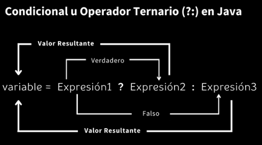

# Operadores

## Aritméticos
|Operador|Resulatado|
|-|-|
|+|Suma entre dos numeros|
|-|Resta entre dos números|
|*|Multiplicación entre dos números|
|/|División entre dos números|
|%|Módulo, Divide dos números y retorna el residuo|

## Unarios
|Operador|Significado|
|-|-|
|- | Este operador se puede utilizar para convertir un valor positivo en uno negativo.|
|! | Esto se utiliza para convertir verdadero a falso o viceversa. Básicamente, invierte el estado lógico de un operando.|
|++ | Operador de incremento: incrementa el valor en 1|
|-- | Operador de disminución: disminuye el valor en 1|
|~ |Este operador unario devuelve la representación en complemento a uno del valor de entrada u operando, es decir, con todos los bits invertidos, lo que significa que hace que cada 0 sea 1 y cada 1 sea 0. |

## De asignación
|Operador|Significado|
|-|-|
|=|Se utiliza para asignar el valor de la derecha a la variable de la izquierda|
|+=|Opera sumando el valor actual de la variable de la izquierda al valor de la derecha y luego asignando el resultado al operando de la izquierda. |
|-=| Opera restando el valor de la variable de la derecha del valor actual de la variable de la izquierda y luego asignando el resultado al operando de la izquierda. |
|*=|Opera multiplicando el valor actual de la variable de la izquierda por el valor de la derecha y luego asignando el resultado al operando de la izquierda. |
|/=|Opera dividiendo el valor actual de la variable de la izquierda por el valor de la derecha y luego asignando el cociente al operando de la izquierda.  |

## Realacionales
|Operador|Significado|
|-|-|
|==|Este operador se utiliza para comprobar si los dos operandos dados son iguales o no|
|!=|Funciona de manera opuesta a la del operador igual a|
|>|Esto verifica si el primer operando es mayor que el segundo operando o no|
|<|Esto verifica si el primer operando es menor que el segundo operando o no|
|>=|Esto verifica si el primer operando es mayor o igual que el segundo operando o no|
|<=|Esto verifica si el primer operando es menor o igual que el segundo operando o no|

## Lógicos
|Operador|Significado|
|-|-|
|&&|Este operador devuelve verdadero cuando ambas condiciones consideradas se cumplen o son verdaderas.|
|\| \||Este operador devuelve verdadero cuando una de las dos condiciones consideradas se cumple o es verdadera|
|\!|Es un operador unario y devuelve verdadero cuando la condición es falsa y viceversa|

## Ternario
```java
variable = Expresíón1 ? Expresión2 : Expresión3
```
__funciona de manera similar a la instrucción if-else, ya que en Exression2 se ejecuta si Expression1 es verdadera; de lo contrario , se ejecuta Expression3__
```java
if(Expresión1){
    variable = Expresión2;
}else{
    variable = Expresión3;
}
```
